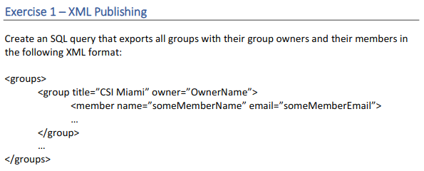
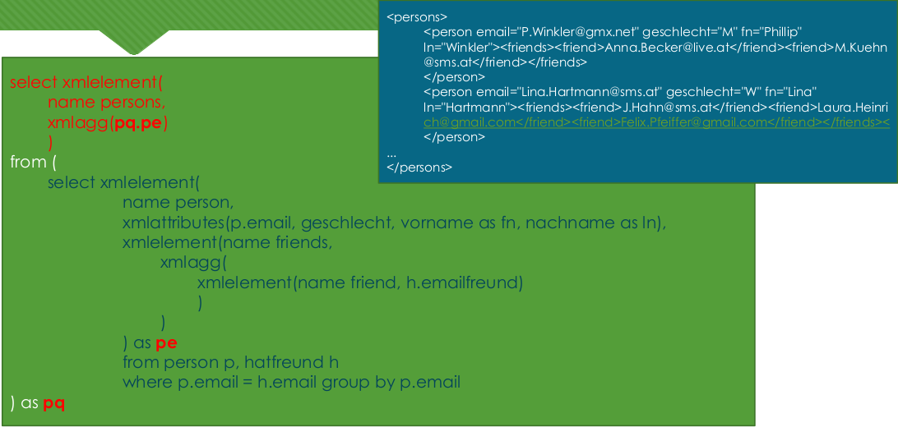
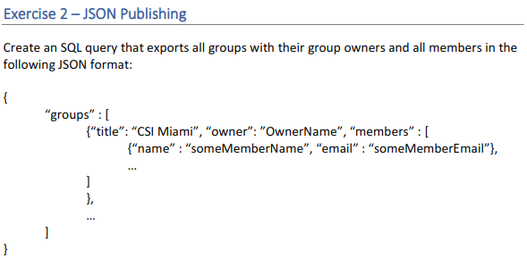
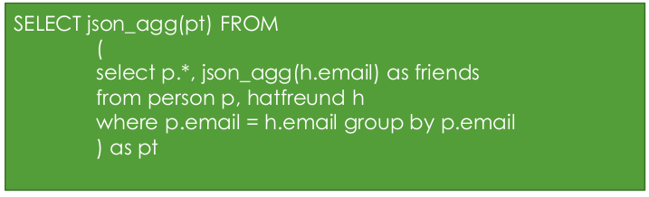
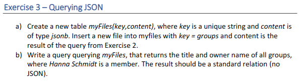
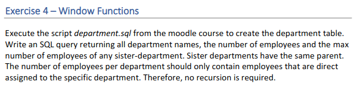
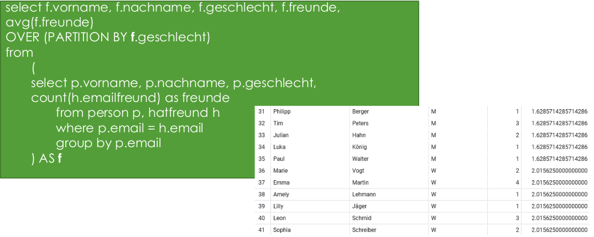
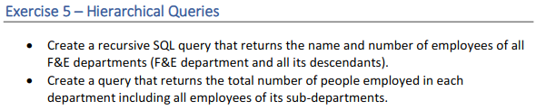
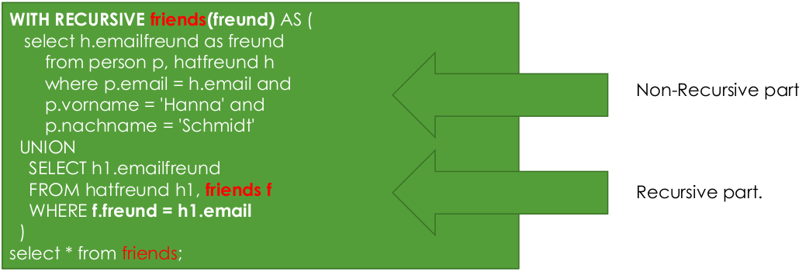

# Assignment 2
## Installation
For Ubuntu 20, install postgresql using
```
~$ sudo apt install postgresql
```
Afterwards, alter the root access to the DBMS
```
~$ sudo -u postgres psql
postgres# \password postgres
```


# Task 1



> Analogy from the example on the slides #2, ""Publishing SQL as XML Example 4"





```
select xmlelement(name groups, xmlagg(pq.pe)) -- The Groups-Tag
from
(
    select xmlelement( name group, xmlattributes(g.name,p.vorname || ' ' || p.nachname as owner), -- The Group tag
        (SELECT xmlagg(xmlelement(name member, xmlattributes(p.vorname || ' ' || p.nachname as name, iig.email))) -- The members
        from istingruppe iig join person p on p.email = iig.email where iig.gruppename = g.name)) as pe -- aggregate the singular group on members and owners within group
    from person p, gruppe g, istingruppe iig
    where p.email = g.emailowner and iig.gruppename = g.name) as pq; -- aggregate the groups
```

# Task 2


> Analogy from the example on the slides #2, ""Publishing relational data as JSON 3"




```
select to_json(groupsq)
from (
select json_agg(gr) as groups
from (select g.name,  p1.nachname || ' ' || p1.vorname as owner, json_agg(gq) as members
	 from gruppe g, istingruppe iig, person p1, (select p.vorname||' '||p.nachname as name, p.email from person p) as gq
	 where gq.email = iig.email and iig.gruppename = g.name
	 group by g.name, p1.nachname, p1.vorname) as gr
) as groupsq;

```

# Task 3



> Creating a new table
```
drop table if exists myFiles;

create table myFiles(
    key varchar(255) unique,
    content jsonb
);

insert into myFiles (key, content) values ('groups',(select to_json(gruppe)
from  (
    select json_agg(gr) as groups from(SELECT g.name,  p1.nachname || ' ' || p1.vorname as owner,
    json_agg(json_build_object('name', p2.nachname || ' ' || p2.vorname,'email', p.email)) as members
    from gruppe g join person p1 on p1.email = g.emailowner, istingruppe p join person p2 on p2.email = p.email
    where g.name = p.gruppename
    group by g.name, owner) as gr) as gruppe) );

select * from myFiles;
```

> Query the table

```
select grp.groups->'name' as groupname, grp.groups->'owner' as owner -- select groups and owners
from (select jsonb_array_elements(content->'groups') as groups from myfiles) as grp -- unnest groups to group
where 'Schmidt Hanna' in (select jsonb_array_elements(grp.groups->'members')->>'name'); -- unnest group to member
```

# Task 4



> Analogy from the example on the slides #2, "Simple Window Functions 2"




```
SELECT d."deptId", d.name, d."numEmpl", d."parentId", avg(d."numEmpl")
    over(partition by d."parentId") as averageempl
FROM public.department d
order by d."deptId" asc
```

# Task 5


> Analogy from the example on the slides #2, "Recursive Common Table Expressions"



```
with recursive employeeoverview(deptId, name, parentId, numEmpl) as
    (
        select d."deptId", d.name, d."parentId", d."numEmpl" from department d where d.name='F&E'
        union
        select dd."deptId", dd.name, dd."parentId", dd."numEmpl" from department dd, employeeoverview eo where dd."parentId" = eo.deptId
    ) select * from employeeoverview;
```

```
with recursive employeecount(deptId, name, parentId, numEmpl) as
    (
        select d."deptId", name, "parentId", "numEmpl" from department d where "deptId"=1
        union
        select dd."deptId", dd.name, dd."parentId", dd."numEmpl" from department dd, employeecount ec where dd."parentId"=ec.deptId
    ) select sum(employeecount.numEmpl) from employeecount;

```


