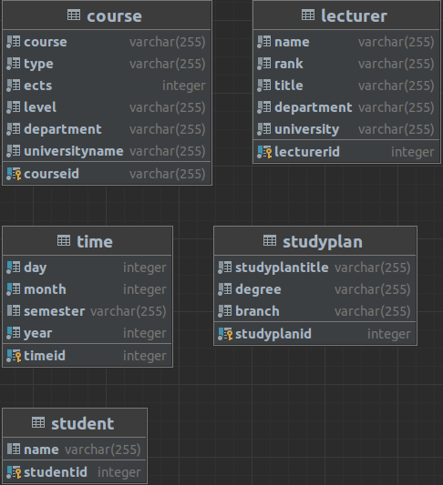
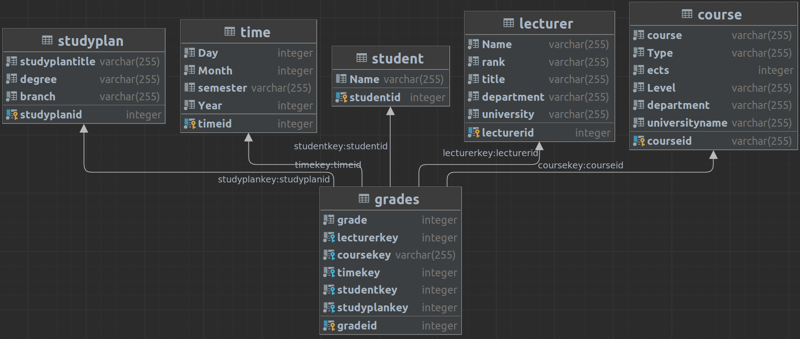

# Assignment 4
- [ ] Create A DWH
  - [X] 1.a
  - [ ] 1.b
- [ ] DWH Querying
- [ ] Data Integration
  - [ ] 3.a
  - [ ] 3.b
  - [ ] 3.c
  - [ ] 3.d

    
## Task 1 - Create A DWH
- [X] Design a suitable DWH schema

Given the required layout for the data as follows ...
```c
// The arrow indicates hierarchy levels. 
// The sets contain multiple attributes at the same hierarch level.

Lecturer:
    {Name, Rank (Univ Ass, Postdoc-Ass, Prof, Ass Prof, …), Title (DI, DR,…)} → Department → University
Course:
    {Course, Type (VO, VC, UE,…), ECTS, Level} → Department* → UniversityName
Time**:
    Day → Month → Semester → Year
Student:
    Name
StudyPlan:
    {StudyplanTitle, Degree (Bachelor/Master), Branch (Technical Studies/Economics)}

* A course is assigned to the budget of some department; this is not necessarily the department where the lecturer is assigned.
** For the time dimension: Only fill the dimension table with the dates of actual exams.
*** The level of a course can differ from the level of a student. Students may already take some master’s courses during their bachelor program.
```
... the utilization of a Star Schema makes sense. \
Reviewing the available JSON-Data, we can assert the following setup.
```sql
DROP TABLE IF EXISTS Lecturer;
DROP TABLE IF EXISTS Course;
DROP TABLE IF EXISTS Time;
DROP TABLE IF EXISTS Student;
DROP TABLE IF EXISTS Studyplan;

-- {Name, Rank (Univ Ass, Postdoc-Ass, Prof, Ass Prof, …), Title (DI, DR,…)} → Department → University
CREATE TABLE Lecturer(
    LecturerID INT NOT NULL,
    Name VARCHAR(255) NOT NULL,
    Rank VARCHAR(255) NOT NULL,
    Title VARCHAR(255) NOT NULL,
    Department VARCHAR(255) NOT NULL,
    University VARCHAR(255) NOT NULL,
    CONSTRAINT PK_Lecturer PRIMARY KEY (
        -- https://www.w3schools.com/sql/sql_primarykey.ASP
        -- Benefit: Names the primary key
        LecturerID
    )
)

-- {Course, Type (VO, VC, UE,…), ECTS, Level} → Department* → UniversityName
CREATE TABLE Course(
    CourseID VARCHAR(255) NOT NULL, -- "ID listed as XXX.XXX" :: Assuming Varchar due to '.'
    Course VARCHAR(255) NOT NULL,
    Type VARCHAR(255) NOT NULL,
    ECTS INT NOT NULL, 
    Level VARCHAR(255) NOT NULL,
    Department VARCHAR(255) NOT NULL,
    UniversityName VARCHAR(255) NOT NULL,
    CONSTRAINT PK_Course PRIMARY KEY (
        CourseID
    )
)

-- Day → Month → Semester → Year
CREATE TABLE Time(
    TimeID INT NOT NULL,
    Day INT NOT NULL,
    Month INT NOT NULL,
    Semester VARCHAR(255), -- No entry matching semester :: Assuming SS/WS
    Year INT NOT NULL,
    CONSTRAINT Pk_Time PRIMARY KEY(
        TimeID
    )
)
-- Access each dimensionality of Time (D, M, Y) -> Index
-- https://dba.stackexchange.com/questions/31420/how-to-create-unique-index-for-month-and-year-column
CREATE UNIQUE INDEX ON Time(Day, Month, Year);


-- Name
CREATE TABLE Student(
    StudentID INT NOT NULL, -- 9,xxx,xxx < 2,147,483,647 (Max INT)
    Name VARCHAR(255),
    CONSTRAINT PK_STUDENT PRIMARY KEY(
        StudentID
    )
)

-- {StudyplanTitle, Degree (Bachelor/Master), Branch (Technical Studies/Economics)}
CREATE TABLE Studyplan(
    StudyplanID INT NOT NULL,
    StudyplanTitle VARCHAR(255) NOT NULL,
    Degree VARCHAR(255) NOT NULL,
    Branch VARCHAR(255) NOT NULL,
    CONSTRAINT PK_Studyplan PRIMARY KEY(
        StudyplanID
    )
)
```

**Notes**: 
- The linking by a common fact table is done in Task 2, over the table ''Grades''.\
- The surrogate keys ( ...ID ) were deemed too useful to avoid.
- To transform this data into a snow flake schema, it would be necessary to split up the dimensionalities into even more tables.



Utilizing a common fact table as proposed in Task 2 (Grades), we construct the DWH Star Schema as such:

```sql
/* 1a_2_GradesCreation.sql */
-- Creation of fact table (Grades)
DROP TABLE IF EXISTS Grades;

-- Needs to correlate to the tables in 1a
CREATE TABLE Grades(
    GradeID SERIAL NOT NULL,
    LecturerKey INT NOT NULL,
    CourseKey VARCHAR(255) NOT NULL,
    TimeKey INT NOT NULL,
    StudentKey INT NOT NULL,
    StudyplanKey INT NOT NULL,
    CONSTRAINT PK_Grades PRIMARY KEY(
        GradeID
    ),
    CONSTRAINT FK_Lecturer FOREIGN KEY (LecturerKey)
        REFERENCES  lecturer(lecturerid)
        ON DELETE CASCADE,
    CONSTRAINT FK_Course FOREIGN KEY (CourseKey)
        REFERENCES course(courseid)
        ON DELETE CASCADE,
    CONSTRAINT FK_Time FOREIGN KEY (TimeKey)
        REFERENCES time(timeid)
        ON DELETE CASCADE,
    CONSTRAINT FK_Student FOREIGN KEY (StudentKey)
        REFERENCES student(studentid)
        ON DELETE CASCADE,
    CONSTRAINT FK_Studyplan FOREIGN KEY (StudyplanKey)
        REFERENCES studyplan(studyplanid)
        ON DELETE CASCADE
);
```




- [ ] Load data from the JSON files

Considerations & reformatting of available data:
- Typos, such as missing ':' (resultlist_webtech, resultlist_interop)
- Missing Data (Date in resultlist_datenbaken)
- Arrays of different length indicate incomplete/overfull data collections 
- Multiple unique identifier "Datenbanktechnologien" & "Datenbanken" have both the ID "620.050"

The data is then loaded into temporary tables for further restructuring (see *1b_1_RawJSONImport.sql*)


## Task 2 - DWH Querying
- [ ] The data should now be shown as a pivot table with the dimensions of student, StudyPlan, and lecturer showing the average grades.
- [ ] Write a query in SQL returning all required data to fill the pivot table and supporting OLAP
operations on the pivot table without issuing an additional query.
- [ ] It is sufficient to only provide the required data in form of an SQL result. You may sketch how the SQL result set relates to the cells of a pivot table. 

## Task 3 - Data Integration
- [ ] Briefly explain the three main phases of Data Integration 
- [ ] Why are Precision and Recall insufficient for assessing matching systems in isolation?
- [ ] Provide an example for a global as view mapping and a local as view mapping for the
following schema: 
```
Global Schema (PK, FK):
Person(id, givenName, lastName, job, age)

Local Schema (PK, FK):
MyPerson(svnr, givenName, lastName, age)
MyPobs (svnr,jobtitle)
```
- [ ] Discuss the benefits and drawbacks of local as view vs global as view regarding
rewriting complexity, change of data sources, and constraints over data sources.

