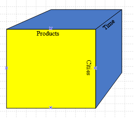
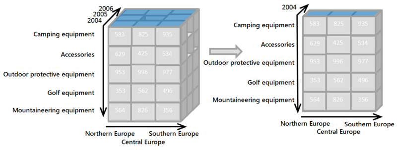
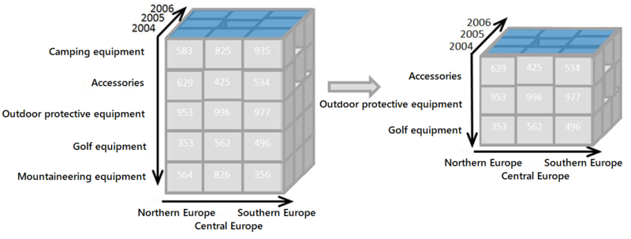
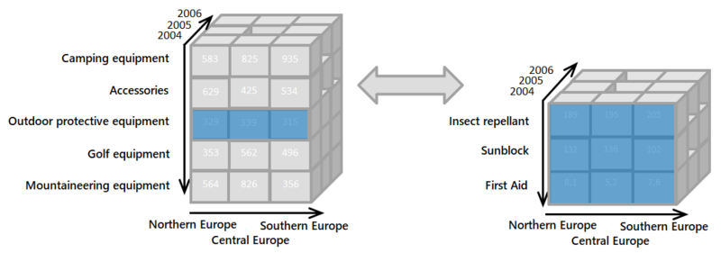
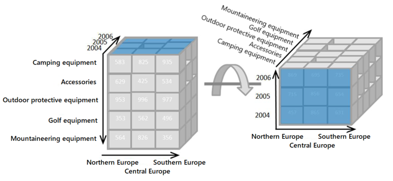
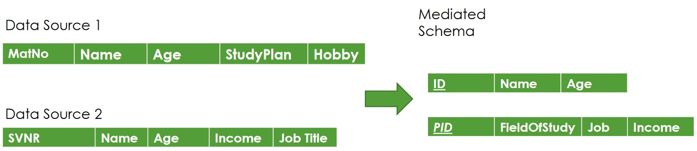
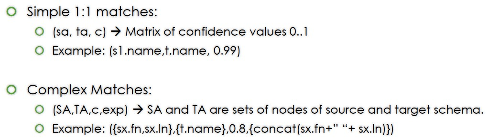
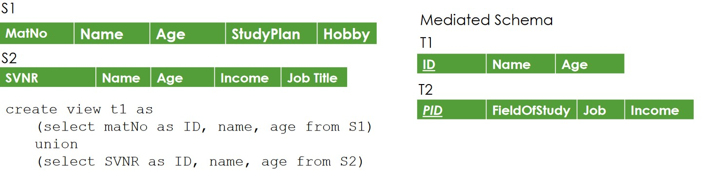
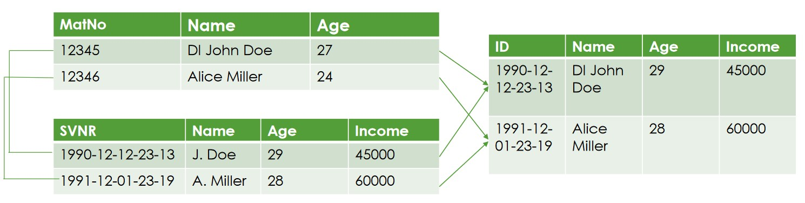
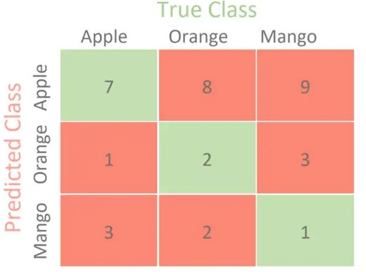

# Assignment 4
- [X] Create A DWH
  - [X] 1.a
  - [X] 1.b
- [X] DWH Querying
- [X] Data Integration
  - [X] 3.a
  - [X] 3.b
  - [X] 3.c
  - [ ] 3.d

    
## Task 1 - Create A DWH
- [X] Design a suitable DWH schema

Given the required layout for the data as follows ...
```c
// The arrow indicates hierarchy levels. 
// The sets contain multiple attributes at the same hierarch level.

Lecturer:
    {Name, Rank (Univ Ass, Postdoc-Ass, Prof, Ass Prof, …), Title (DI, DR,…)} → Department → University
Course:
    {Course, Type (VO, VC, UE,…), ECTS, Level} → Department* → UniversityName
Time**:
    Day → Month → Semester → Year
Student:
    Name
StudyPlan:
    {StudyplanTitle, Degree (Bachelor/Master), Branch (Technical Studies/Economics)}

* A course is assigned to the budget of some department; this is not necessarily the department where the lecturer is assigned.
** For the time dimension: Only fill the dimension table with the dates of actual exams.
*** The level of a course can differ from the level of a student. Students may already take some master’s courses during their bachelor program.
```
... the utilization of a Star Schema makes sense. \
Reviewing the available JSON-Data, we can assert the following setup.
```sql
DROP TABLE IF EXISTS Grades;
DROP TABLE IF EXISTS Lecturer;
DROP TABLE IF EXISTS Course;
DROP TABLE IF EXISTS Time;
DROP TABLE IF EXISTS Student;
DROP TABLE IF EXISTS Studyplan;

-- {Name, Rank (Univ Ass, Postdoc-Ass, Prof, Ass Prof, …), Title (DI, DR,…)} → Department → University
CREATE TABLE Lecturer(
    LecturerID INT NOT NULL,
    "Name" VARCHAR(255) NOT NULL,
    Rank VARCHAR(255) NOT NULL,
    Title VARCHAR(255) NOT NULL,
    Department VARCHAR(255) NOT NULL,
    University VARCHAR(255) NOT NULL,
    CONSTRAINT PK_Lecturer PRIMARY KEY (
        -- https://www.w3schools.com/sql/sql_primarykey.ASP
        -- Benefit: Names the primary key
        LecturerID
    )
);

-- {Course, Type (VO, VC, UE,…), ECTS, Level} → Department* → UniversityName
CREATE TABLE Course(
    CourseID VARCHAR(255) NOT NULL, -- "ID listed as XXX.XXX" :: Assuming Varchar due to '.'
    Course VARCHAR(255) NOT NULL,
    "Type" VARCHAR(255) NOT NULL,
    ECTS INT NOT NULL,
    "Level" VARCHAR(255) NOT NULL,
    Department VARCHAR(255) NOT NULL,
    UniversityName VARCHAR(255) NOT NULL,
    CONSTRAINT PK_Course PRIMARY KEY (
        CourseID
    )
);

-- Day → Month → Semester → Year
CREATE TABLE Time(
    TimeID SERIAL NOT NULL, -- Serial: Autogenerate key, as we don't have an ID written in JSON
    "Day" INT NOT NULL,
    "Month" INT NOT NULL,
    Semester VARCHAR(255), -- No entry matching semester :: Assuming SS/WS
    "Year" INT NOT NULL,
    CONSTRAINT Pk_Time PRIMARY KEY(
        TimeID
    )
);

-- Name
CREATE TABLE Student(
    StudentID INT NOT NULL, -- 9,xxx,xxx < 2,147,483,647 (Max INT)
    "Name" VARCHAR(255),
    CONSTRAINT PK_STUDENT PRIMARY KEY(
        StudentID
    )
);

-- {StudyplanTitle, Degree (Bachelor/Master), Branch (Technical Studies/Economics)}
CREATE TABLE Studyplan(
    StudyplanID INT NOT NULL,
    StudyplanTitle VARCHAR(255) NOT NULL,
    Degree VARCHAR(255) NOT NULL,
    Branch VARCHAR(255) NOT NULL,
    CONSTRAINT PK_Studyplan PRIMARY KEY(
        StudyplanID
    )
);
```

**Notes**: 
- The linking by a common fact table is done in Task 2, over the table ''Grades''.\
- Some surrogate keys ( ...ID ) were deemed too useful to avoid.
- To transform this data into a snow flake schema, it would be necessary to split up the dimensionalities into even more tables.


Utilizing a common fact table as proposed in Task 2 (Grades), we construct the DWH Star Schema as such:
```sql
/* 1a_2_GradesCreation.sql */
-- Creation of fact table (Grades)
-- Needs to correlate to the tables in 1a
CREATE TABLE Grades(
    GradeID SERIAL NOT NULL,
    Grade INT NOT NULL, 
    LecturerKey INT NOT NULL,
    CourseKey VARCHAR(255) NOT NULL,
    TimeKey INT NOT NULL,
    StudentKey INT NOT NULL,
    StudyplanKey INT NOT NULL,
    CONSTRAINT PK_Grades PRIMARY KEY(
        GradeID
    ),
    CONSTRAINT FK_Lecturer FOREIGN KEY (LecturerKey)
        REFERENCES  lecturer(lecturerid)
        ON DELETE CASCADE,
    CONSTRAINT FK_Course FOREIGN KEY (CourseKey)
        REFERENCES course(courseid)
        ON DELETE CASCADE,
    CONSTRAINT FK_Time FOREIGN KEY (TimeKey)
        REFERENCES time(timeid)
        ON DELETE CASCADE,
    CONSTRAINT FK_Student FOREIGN KEY (StudentKey)
        REFERENCES student(studentid)
        ON DELETE CASCADE,
    CONSTRAINT FK_Studyplan FOREIGN KEY (StudyplanKey)
        REFERENCES studyplan(studyplanid)
        ON DELETE CASCADE
);
```


- [X] Load data from the JSON files

Considerations & reformatting of available data:
- Typos, such as missing ':' (resultlist_webtech, resultlist_interop)
- Missing Data (Date in resultlist_datenbaken)
- Arrays of different length indicate incomplete/overfull data collections 
- Multiple unique identifier "Datenbanktechnologien" & "Datenbanken" have both the ID "620.050"

The data is read and aggregated using a custom python script.
View /py/psql_dwh_creator.py. Refer to the comments within the script for explanations:


## Task 2 - DWH Querying
- [X] The data should now be shown as a pivot table with the dimensions of student, StudyPlan, and lecturer showing the average grades. Write a query in SQL returning all required data to fill the pivot table and supporting OLAP
operations on the pivot table without issuing an additional query.

A pivot-table displays relational information via multiple dimensions, similar to cube-like structures.



In order to query from such a cube, we need to utilize the OLAP operations.

### Slicing


Slice is the act of picking a rectangular subset of a cube by choosing a single value for one of its dimensions, creating a new cube with one fewer dimension

### Dicing


The dice operation produces a subcube by allowing the analyst to pick specific values of multiple dimensions.

### Drilling Down/Up


Drill Down/Up allows the user to navigate among levels of data ranging from the most summarized (up) to the most detailed (down).

### Rollup/Pivoting


A roll-up involves summarizing the data along a dimension. The summarization rule might be an aggregate function, such as computing totals along a hierarchy or applying a set of formulas such as "profit = sales - expenses". General aggregation functions may be costly to compute when rolling up: if they cannot be determined from the cells of the cube, they must be computed from the base data, either computing them online (slow) or precomputing them for possible rollouts (large space). 

To query such operations, we utilize "GROUPING" within the SQL-Query.
```sql
SELECT avg(g.grade) as "avg_grade",
       s.studentid, s."Name",
       l.lecturerid, l."Name", l.rank, l.title, l.university,
       s2.studyplanid, s2.studyplantitle, s2.branch, s2.degree
FROM grades g
JOIN lecturer l on g.lecturerkey = l.lecturerid
JOIN student s on g.studentkey = s.studentid
JOIN studyplan s2 on g.studyplankey = s2.studyplanid
GROUP BY GROUPING SETS (
    (s.studentid, s."Name"), (s.studentid),
    (l.lecturerid, l."Name", l.rank, l.title, l.university), (l.lecturerid, l."Name", l.rank, l.title), (l.lecturerid, l."Name", l.rank), (l.lecturerid, l."Name"), (l.lecturerid),
    (s2.studyplanid, s2.studyplantitle, s2.branch, s2.degree), (s2.studyplanid, s2.studyplantitle, s2.branch), (s2.studyplanid, s2.studyplantitle), (s2.studyplanid),
    (s."Name", s2.studyplantitle, l."Name")
)
```

- [X] It is sufficient to only provide the required data in form of an SQL result. You may sketch how the SQL result set relates to the cells of a pivot table. 

View /sql/2_OLAPQuery.csv for some exemplary aggregations, which was generated by the SQL-Query above.


## Task 3 - Data Integration
- [X] Briefly explain the three main phases of Data Integration 

The three main phases of data integration are
- Schema Alignment: Using multiple schemas of a singular domain, we create a schema providing a unified view of the different sources which captures the relevant aspects of the domain. This includes 3 Steps:
    * Mediating the Schema 
    * Matching Attributes 
    * Schema Mapping 
- Record Linkage: Views singular records to identify entities on instance level. 
- Data fusion: Utilizes record linkage to merge multiple tables of relational information into a single one 


- [ ] Why are Precision and Recall insufficient for assessing matching systems in isolation?

Precision is a measure to identify what proportion of hits was correct, formulated as $$Precision = \frac{TP}{TP + FP}$$

.. whereas recall (also known as true positive rate or sensitivity) is a measure to identify how many actual hits were identified correctly, formulated as $$Recall = \frac{TP}{TP+FP}$$


### Example


Assuming this result of an dataset, we can assess the following rates for the class 'Apple':
| Apple | |
| --|--|
| TP | 7 |
| TN | 8 |
| FP | 17|
| FN | 4 |

As such, we can calculate Precision and Recall s.t.

$$Precision = \frac{7}{7+17} = 0,29$$
$$Recall = \frac{7}{7+4} = 0,64$$

i.e.: 29% (7 out of 24) of positive sample identifications was correct (precision) while 64% (7 out of 11) of actual positives samples were identified correctly.

### Why precision and Recall may be insufficient
- Precision: perfect score of 1 is achieved if every result is relevan, but doesn´t say whether all relevant results are received. Can be seen as quality measurement.
- Recall: perfect score of 1 is achieved if all relevant results are received, but it doesn´t say how many are irrelevant. Can be seen as quantity measurement.

In case of precision there might be results missing, even if the score is high. In case of recall there might be entries that are irrelevant.
Hence, we require additional or combinations of measurements.


- [X] Provide an example for a global as view mapping and a local as view mapping for the
following schema: 
```
Global Schema (PK, FK):
Person(id, givenName, lastName, job, age)

Local Schema (PK, FK):
MyPerson(svnr, givenName, lastName, age)
MyPobs (svnr,jobtitle)
```

```sql
-- Gav 
Create view Person as
  (select svnr as id, givenName, lastName, age from MyPerson)
  Union
  (select svnr as id, jobtitle as job from MyPobs)

-- Lav
Create view MyPerson as
  Select id as svnr, givenName, lastName, age from person
Create view myPobs as
  Select id as svnr, job as jobtitle from person
```


- [ ] Discuss the benefits and drawbacks of local as view vs global as view regarding rewriting complexity, change of data sources, and constraints over data sources.


# References & Links
- Schema pictures generated using Datagrip
- OLAP pictures: https://en.wikipedia.org/wiki/OLAP_cube
- OLAP tutorial: https://www.postgresqltutorial.com/postgresql-tutorial/postgresql-cube/
- Data Engineering lecture slides
- Artificial Intelligence & Machine learning slides
- Precision and Recall picture: https://en.wikipedia.org/wiki/Precision_and_recall
- Precision & Recall example: https://towardsdatascience.com/confusion-matrix-for-your-multi-class-machine-learning-model-ff9aa3bf7826